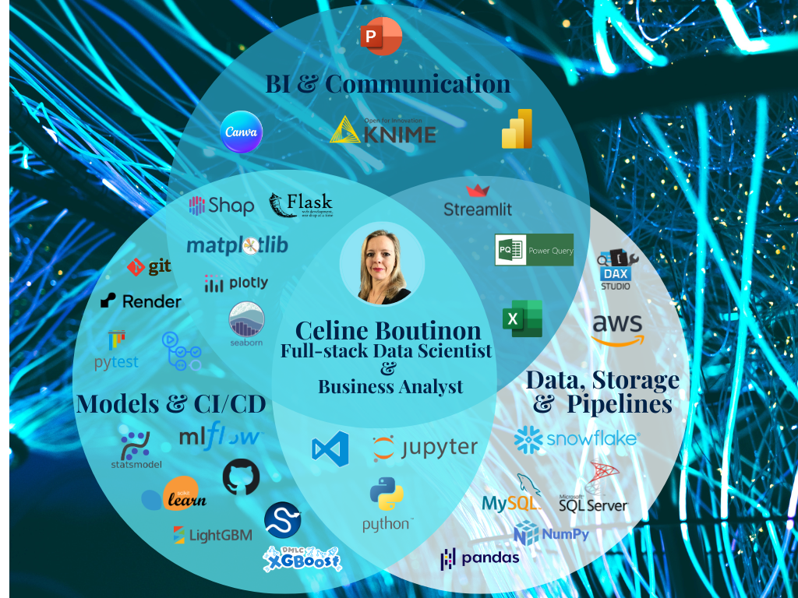
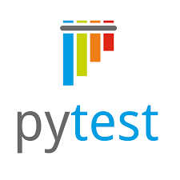

 

 <h2 align="left">:sparkles: About me: </h2>
A detail-oriented, high-performing and effective team player with extensive
experience in dynamic, multicultural work environments. Recognised for effective
problem-solving skills and active stakeholder engagement.

 
<ul>
<li>🔭 :seedling: :tomato: I’m currently working on harnessing the power of Sagemaker AI for my next portfolio project.</li>
<li>🌱 :mortar_board: I’m currently learning PySpark, Airflow & Docker to boost my data engineering skills.</li>
<li>💬 :thought_balloon: Ask me about [TBC].</li>
<li>⚡ :hot_pepper: :mushroom: :rock: Fun fact: I'm a rockhound & mushroom enthusiast.</li>
</ul>
 

<h2 align="left"> :sparkles: Skills:</h2>

<h3 align="left"> :pushpin: Databases & Pipelines:</h3>
<!-- AWS -->

<!-- Microsoft SQL Server -->

<!-- MySQL -->

<!-- Snowflake -->

<!-- MySQL Workbench -->

<h3 align="left"> :pushpin: Data Wrangling, Modelling & Algorithms:</h3>
<!-- Python -->

<!-- Jupyter -->

<!-- Numpy -->

<!-- Pandas -->

<!-- Scikit-learn -->

<!-- Statsmodels API -->

<!-- Scipy -->

<h3 align="left"> :pushpin: Deployment & Infrastructure:</h3>
<!-- Docker 
 -->
<!-- Visual Studio Code -->

<!-- GitHub Actions -->

<!-- Pytest -->

<!-- Flask -->

<!-- MLflow -->

<h3 align="left"> :pushpin: Data Visualisation:</h3>
<!-- Matplotlib -->

<!-- Seaborn -->

<!-- Plotly Express -->

<!-- Shap -->

<h3 align="left"> :pushpin: Business Intelligence & Communication:</h3>
<!-- DAX Studio -->

<!-- Power BI -->

<!-- Streamlit -->

<!-- Excel -->

<!-- Power Query -->

<!-- KNIME Analytics -->

<!-- Canva -->
 

<h3 align="left"> :pushpin: Deployment & Infrastructure:</h3>
<!-- Docker 
 -->
<!-- Visual Studio Code -->

<!-- GitHub Actions -->

<!-- Pytest -->

<!-- Flask -->

<!-- MLflow -->

