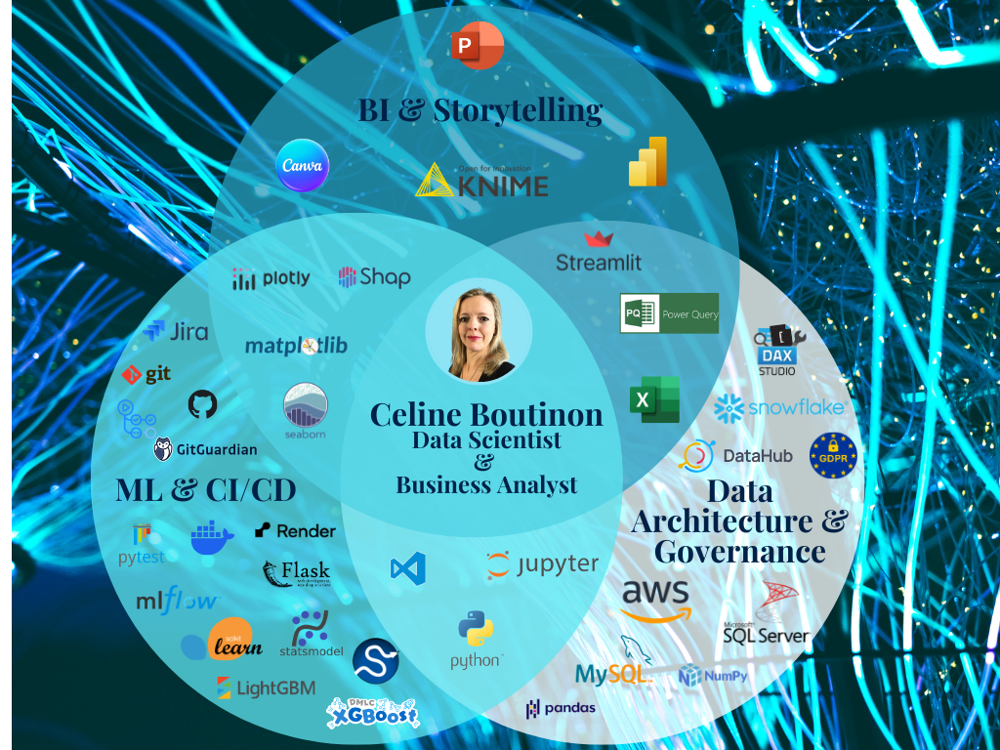
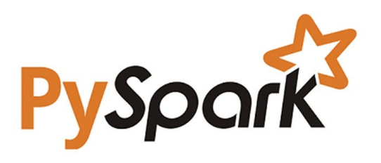

 

 
 

 <h2 align="center">:pick: I transform raw data into actionable business insights :gem: </h2>

 
<h2 align="left"> :mortar_board: What I'm currently learning</h2>

  
  
  

 
 

<h2 align="left"> :sparkles: Check out my latest projects</h2>
<h3 align="left"> :pushpin: Market segmentation & customer behaviour  </h3>
<ul>
<li>Establishing & maintaining a customer segmentation model for online Brazilian marketplace <a href=https://github.com/CelineBoutinon/client-segmentation target="_blank" rel="noreferrer">Olist</a></li>
 
<li>Identifying & analysing potential export markets for French <a href= https://github.com/CelineBoutinon/chicken-run target="_blank" rel="noreferrer">chicken</a> products</li>
</ul>

<h3 align="left"> :pushpin: Fraud prevention & detection </h3>
<ul>
<li>Safeguarding personal data against identity theft with <a href=https://github.com/CelineBoutinon/FiligraneMalin target="_blank" rel="noreferrer">Filigrane Malin</a>, a privacy-focused, local-first PDF and image watermarking desktop app built with Streamlit</li>
 
<li>Detecting <a href=https://github.com/CelineBoutinon/faux-billets target="_blank" rel="noreferrer">counterfeit banknotes</a></li>
 
<li>Establishing an individual's <a href=https://github.com/CelineBoutinon/credit-scoring target="_blank" rel="noreferrer">credit score</a> to justify consumer credit application decisions</li>
</ul>

<h3 align="left"> :pushpin: Image classification </h3>
<ul>
<li>Classifying consumer products with CNNs, text vectors & text embeddings for an online <a href=https://github.com/CelineBoutinon/product-classification target="_blank" rel="noreferrer">marketplace</a></li>
 
<li>A Big Data image classification architecture applied to <a href=https://github.com/CelineBoutinon/big-data-cloud
target="_blank" rel="noreferrer">fruits recognition</a> with AWS EMR</li>
 
<li>An applied performance <a href=https://github.com/CelineBoutinon/visual-transformers target="_blank" rel="noreferrer">comparison</a> of visual transformers with CNN image classifiers</li>
</ul>

<h3 align="left"> :pushpin: Model serving & CI/CD </h3>
<ul>
<li>Predicting the energy consumption & greenhouse gas emissions of non-residential buildings for the <a href=https://github.com/CelineBoutinon/energy-consumption target="_blank" rel="noreferrer">City of Seattle</a></li>
 
<li>Deploying a consumer credit risk assessment & decision <a href=https://github.com/CelineBoutinon/credit-scoring-api target="_blank" rel="noreferrer">tool</a> on Streamlit with PyTest, Flask & Render</li>
</ul>

<h3 align="left"> :pushpin: Inclusive storytelling </h3>
<ul>
<li>Creating a <a href=https://github.com/CelineBoutinon/WCAG-accessible-dashboard target="_blank" rel="noreferrer">dashboard</a> for colorblind & visually impaired users with Shap and Streamlit</li>
 
<li>Analysing worldwide access to <a href=https://github.com/CelineBoutinon/drinking-water-for-all target="_blank" rel="noreferrer">drinking water</a> with PowerBI </li>
</ul>

<h3 align="left"> :pushpin: Data mining & exploratory data analysis  </h3>
<ul>
<li>Data quality analysis & inventory management for an online <a href=https://github.com/CelineBoutinon/bottleneck target="_blank" rel="noreferrer">fine wine store</a></li>
 
<li>A GDPR-compliant, no-code analysis of  <a href=https://github.com/CelineBoutinon/lafleche-et-associes target="_blank" rel="noreferrer">gender equality</a> in the workplace with Knime Analytics</li>
 
<li>A worldwide analysis of   <a href=https://github.com/CelineBoutinon/la-faim-dans-le-monde target="_blank" rel="noreferrer">food insecurity</a> with a focus on the Thai cassava paradox</li>
</ul>

<h3 align="left"> :pushpin: Statistical analyses & tests   </h3>
<ul>
<li>Characterizing the behaviour of an <a href=https://github.com/CelineBoutinon/bookwormstarget="_blank" rel="noreferrer">online bookstore</a>'s clients</li>
 
<li>Qualifying   <a href=https://github.com/CelineBoutinon/nutrition-informationtarget="_blank" rel="noreferrer">nutrition information</a> on food products' labels</li>
 
<li>Ranking the world's leading  <a href=https://github.com/CelineBoutinon/education-statisticstarget="_blank" rel="noreferrer">education systems</a></li>
</ul>

<h3 align="left"> :pushpin: Data Engineering & Database management </h3>
<ul>
<li>Developing a local-first, cost-efficient <a href="https://github.com/CelineBoutinon/mailbreak" target="_blank" rel="noreferrer">email archive & backup</a> to bypass Yahoo's newly enforced storage caps and efficiently query & retrieve legacy email offline
 
<li>Building & querying a  <a href="https://github.com/CelineBoutinon/little-lemon" target="_blank" rel="noreferrer">restaurant</a>'s staff & customer database in MySQL with a Python client</li>
 
<li>Using public data to create a nationwide <a href=https://github.com/CelineBoutinon/laplace-immo target="_blank" rel="noreferrer">real-estate database</a> with MySQL Workbench</li>
</ul>

<h3 align="left"> 🏮 I’m currently putting the finishing touches on the upcoming release of <b>Japankify</b>—a Japanese kanji & vocabulary learning and SRS analytics application aimed at JLPT N3 learners... watch this space!</h3>

 
<h2 align="left"> :sparkles: Find me on</h2>

  
  &nbsp;&nbsp;&nbsp;&nbsp;
  
  &nbsp;&nbsp;&nbsp;&nbsp;
  

