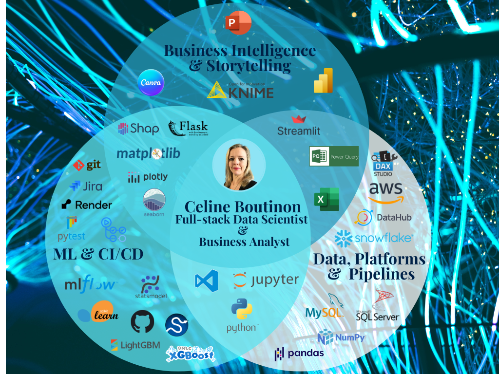
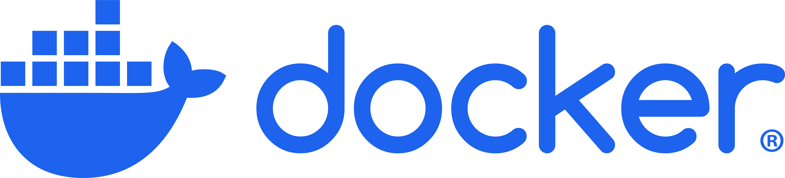

 

 <h2 align="center">:pick: I transform raw data into actionable business insights :gem: </h2>

<h2 align="center"> :mortar_board: What I'm currently learning:</h2>

  
  
  

<h2 align="left"> :sparkles: My portfolio:</h2>

:tomato: I’m currently working on harnessing the power of Sagemaker AI for my next portfolio project... watch this space!

<h2 align="left"> :pushpin: Contact me:</h2>

  
  

